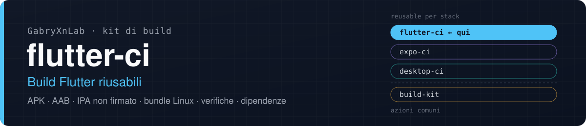
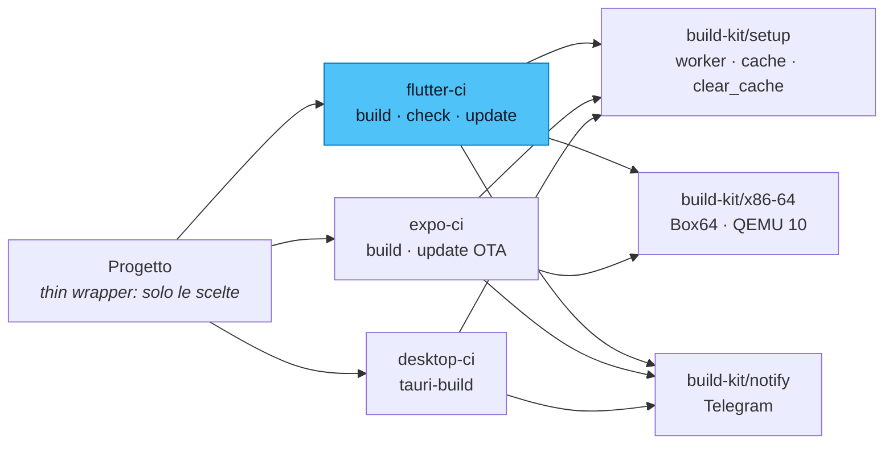

<p align="center">
  
</p>

<p align="center">
  <a href="https://github.com/GabryXnLab/flutter-ci"><b>flutter-ci</b></a> ·
  <a href="https://github.com/GabryXnLab/expo-ci">expo-ci</a> ·
  <a href="https://github.com/GabryXnLab/desktop-ci">desktop-ci</a> ·
  <a href="https://github.com/GabryXnLab/build-kit">build-kit</a>
</p>

<p align="center">
  
  
  <a href="https://github.com/GabryXnLab/kagami/actions/workflows/build.yml"></a>
  <a href="LICENSE"></a>
  <a href="https://github.com/GabryXnLab/flutter-ci/commits/main"></a>
</p>

**Build, verifiche e aggiornamento delle dipendenze di un progetto Flutter/Dart con un wrapper di dieci righe: APK, AAB, IPA iOS non firmato o bundle Linux, con la firma controllata e l'esito su Telegram.**

[Perché](#perché) · [Avvio rapido](#avvio-rapido) · [Cosa c'è](#cosa-cè) · [Riferimento](#riferimento) · [Architettura](#architettura) · [Fuori dall'org](#usarlo-fuori-dallorg) · [Manutenzione](#per-chi-lo-mantiene)

## Perché

- **Ogni formato da un solo workflow.** APK universale o uno per architettura, AAB per il Play Store, bundle Linux, e **IPA iOS non firmato** sul macOS di GitHub, senza account Apple Developer: lo firma chi lo installa, con AltStore o Sideloadly.
- **AOT Android anche su un runner ARM64.** Flutter non pubblica `gen_snapshot` per host linux-arm64, e quello x86-64 sotto il QEMU 8.2 di Ubuntu va in `SIGSEGV`. Qui gira con Box64: **46 s invece dei 316 s di QEMU 10**, con un `app.so` identico byte per byte. Siccome l'output finisce su un telefono, il wrapper compila **due volte in parallelo** e accetta il risultato solo se le due esecuzioni riescono e coincidono; altrimenti ripete con QEMU.
- **Incrementale sul self-hosted.** Il checkout non pulisce, quindi intermedi di Flutter, Gradle, Kotlin e CMake restano fra i run: una build che non cambia il Dart non rifà l'AOT (Kagami: 41 s di build, 1 min 20 s tutto il run).
- **La firma si controlla, non si spera.** La chiave arriva dai secret su qualunque runner; dopo la build il riepilogo del run riporta SHA-1 e SHA-256 di ogni file, e se una release è firmata con una chiave diversa da quella passata la build **fallisce** invece di consegnare un APK che non si installa sopra il precedente. I file scritti dai secret si cancellano a fine job.
- **Pronto per i runner di GitHub.** Con `runner: github` si scaricano JDK e SDK Flutter, SDK, pub cache e Gradle passano dalla cache di GitHub, e su un runner piccolo (2 CPU e 7 GB nei repo privati) la memoria di Gradle si abbassa e si aggiunge swap: il primo run senza questo passaggio era stato spento per memoria esaurita.
- **Non solo build.** `flutter-check` fa formato, analisi, test, pacchetti Dart puri del repo e il controllo che il codice generato committato sia ancora quello di `build_runner`. `flutter-update` alza le dipendenze, verifica e committa il lockfile, anche a secco.
- **Stessi input della famiglia.** `runner`, `max_workers` (`auto` = le CPU libere in quel momento) e `clear_cache` (pulisce il progetto, mai le cache condivise con gli altri) hanno lo stesso significato in `expo-ci` e `desktop-ci`, perché li interpreta [`build-kit/setup`](https://github.com/GabryXnLab/build-kit#setup-worker-e-cache).
- **In produzione.** Gli APK e l'IPA di ogni merge di [Kagami](https://github.com/GabryXnLab/kagami) escono da qui, sui runner di GitHub.

## Avvio rapido

Nel progetto, `.github/workflows/build-android.yml`:

```yaml
name: Build Android
run-name: Build Android · ${{ inputs.build_mode }}

on:
  workflow_dispatch:
    inputs:
      build_mode:
        type: choice
        options: [release, debug, profile]
        default: release

jobs:
  android:
    uses: GabryXnLab/flutter-ci/.github/workflows/flutter-build.yml@main
    with:
      app_name: MiaApp
      runner: github                  # fuori dall'org è obbligatorio: vedi sotto
      flutter_version: '3.47.4'
      build_mode: ${{ inputs.build_mode }}
    secrets:
      ANDROID_KEYSTORE: ${{ secrets.ANDROID_KEYSTORE }}
      ANDROID_KEYSTORE_PASSWORD: ${{ secrets.ANDROID_KEYSTORE_PASSWORD }}
      ANDROID_KEY_ALIAS: ${{ secrets.ANDROID_KEY_ALIAS }}
      ANDROID_KEY_PASSWORD: ${{ secrets.ANDROID_KEY_PASSWORD }}
```

Nessun secret è obbligatorio. Quelli che contano:

| Secret | A cosa serve | Senza |
| :--- | :--- | :--- |
| `ANDROID_KEYSTORE` (+ `_PASSWORD`, `ANDROID_KEY_ALIAS`, `ANDROID_KEY_PASSWORD`) | firma della release, su qualunque runner | su GitHub una chiave nuova a ogni run, con un avviso |
| `GOOGLE_SERVICES_JSON` | `android/app/google-services.json` di chi compila | nessun file |
| `DART_DEFINES` | `--dart-define` da non scrivere nel wrapper | nessuno |
| `TELEGRAM_BOT_TOKEN`, `TELEGRAM_CHAT_ID` | esito e file su Telegram (con l'input `telegram_topic_id`) | nessuna notifica, in silenzio |

I secret si passano **per nome**, mai con `secrets: inherit`: da un altro owner arriverebbero vuoti.

<details>
<summary>La firma: cosa deve fare il progetto</summary>

Il keystore va nel secret in base64 (`base64 -w0 <file> | gh secret set ANDROID_KEYSTORE -R <owner>/<progetto>`) e arriva a Gradle da `android/key.properties`, lo schema della [documentazione di Flutter](https://docs.flutter.dev/deployment/android#configure-signing-in-gradle): **il `build.gradle` del progetto deve leggerlo**. Copiarlo in `~/.android/debug.keystore` non basta, perché sui runner di GitHub Gradle ignora quel file e ne genera un altro.

| Secret | Se vuoto |
| :--- | :--- |
| `ANDROID_KEYSTORE` | sul self-hosted la chiave della macchina; su GitHub `ANDROID_DEBUG_KEYSTORE`, e senza anche quello una chiave nuova a ogni run (avviso nel log) |
| `ANDROID_KEYSTORE_PASSWORD`, `ANDROID_KEY_ALIAS`, `ANDROID_KEY_PASSWORD` | quelli di una chiave di debug: `android`, `androiddebugkey`, password della chiave = password del keystore |
| `ANDROID_DEBUG_KEYSTORE` | solo su GitHub e solo senza `ANDROID_KEYSTORE`: un `debug.keystore` in base64, per i wrapper che lo passano già |

Il controllo della firma riguarda le `release`: debug e profile Gradle li firma con la sua chiave di debug. A fine job `key.properties` e `google-services.json` si cancellano (sul self-hosted il checkout resta fra i run).

</details>

<details>
<summary>Valori segreti come <code>--dart-define</code></summary>

Un secret non si può usare in `with:`, ma si può comporre nel blocco `secrets:` del wrapper:

```yaml
    secrets:
      GOOGLE_SERVICES_JSON: ${{ secrets.GOOGLE_SERVICES_JSON }}
      DART_DEFINES: SENTRY_DSN=${{ secrets.SENTRY_DSN }}
```

`DART_DEFINES` ha lo stesso formato dell'input `dart_defines`: coppie `CHIAVE=valore` separate da spazi.

</details>

<details>
<summary>IPA iOS non firmato</summary>

```yaml
  ios:
    uses: GabryXnLab/flutter-ci/.github/workflows/flutter-build.yml@main
    with:
      app_name: MiaApp
      runner: github
      platform: ios
      flutter_version: '3.47.4'
```

Compila su `macos-latest` con `flutter build ios --release --no-codesign`, poi zippa `Payload/<App>.app` in `<app_name>-ios-<build_mode>-unsigned.ipa`, artefatto del run e file su Telegram. Con il self-hosted il job si ferma subito con un errore, invece di accendere un runner macOS solo per dirlo. I plugin li risolve Flutter (Swift Package Manager, o CocoaPods per chi non lo supporta); deployment target e `Podfile`, se servono, sono del progetto. In un repo privato un minuto macOS vale dieci minuti Linux; nei repo pubblici i minuti sono gratis.

</details>

<details>
<summary>Verifica e aggiornamento delle dipendenze</summary>

```yaml
jobs:
  check:
    uses: GabryXnLab/flutter-ci/.github/workflows/flutter-check.yml@main
    with:
      app_name: MiaApp
      runner: github
      flutter_version: '3.47.4'
      verify_generated: true          # se i .g.dart sono committati
      dart_packages: packages/core    # pacchetti Dart puri del repo, se ci sono
```

```yaml
jobs:
  update:
    permissions:
      contents: write                 # committa il lockfile
    uses: GabryXnLab/flutter-ci/.github/workflows/flutter-update.yml@main
    with:
      app_name: MiaApp
      runner: github
      flutter_version: '3.47.4'
      commit: false                   # prova a secco: solo il riepilogo
```

`flutter-update` non è un aggiornamento OTA: in Flutter il Dart è compilato AOT dentro l'APK, quindi aggiorna le **dipendenze** e il lockfile, e l'APK lo rifà `flutter-build`.

</details>

## Cosa c'è

| Workflow | Cosa fa |
| :--- | :--- |
| [`flutter-build.yml`](.github/workflows/flutter-build.yml) | APK/AAB Android, bundle Linux o IPA iOS non firmato; analisi e test prima di compilare, firma verificata, artefatto del run e invio su Telegram |
| [`flutter-check.yml`](.github/workflows/flutter-check.yml) | formato, analisi statica, test, pacchetti Dart puri (`dart_packages`), controllo del codice generato |
| [`flutter-update.yml`](.github/workflows/flutter-update.yml) | `flutter pub upgrade` con verifica e commit del lockfile |

## Riferimento

Tutti gli input sono facoltativi tranne `app_name`. Nei tre workflow valgono anche `runner` (`self-hosted` \| `github`, default `self-hosted`), `flutter_version` (solo con `runner: github`; vuoto = l'ultima stable), `has_submodules`, `telegram_topic_id` (vuoto = nessuna notifica) e i secret `TELEGRAM_BOT_TOKEN`, `TELEGRAM_CHAT_ID` e `SUBMODULES_TOKEN` (PAT in sola lettura per submodule privati di altri repo; senza, `github.token`).

<details>
<summary><code>flutter-build.yml</code>: input</summary>

| Input | Default | |
| :--- | :--- | :--- |
| `app_name` | obbligatorio | nome dell'artefatto e della notifica |
| `platform` | `android` | `android` \| `linux` \| `ios` (solo con `runner: github`) |
| `artifact` | `apk` | solo Android: `apk` \| `aab` |
| `build_mode` | `release` | `debug` \| `profile` \| `release` |
| `target_platform` | `android-arm64` | ABI separate da virgola; vuoto = quelle di default di Flutter |
| `split_per_abi` | `false` | un APK per ABI invece di uno universale |
| `build_name`, `build_number` | `''` | sovrascrivono versionName e versionCode di `pubspec.yaml` |
| `dart_defines` | `''` | `--dart-define` aggiuntivi, separati da spazi |
| `run_build_runner` | `false` | `build_runner build` prima della build, per chi non committa i `.g.dart` |
| `run_analyze` | `true` | `flutter analyze` prima di compilare |
| `run_tests` | `true` | `flutter test` prima di compilare |
| `max_workers` | `auto` | worker di Gradle e CMake: `auto` \| `2` \| `4` |
| `clear_cache` | `false` | svuota `build/`, `.dart_tool/` e gli intermedi del progetto, e per questo run non si fida della build cache |
| `ref` | `''` | ref da estrarre; vuoto = `github.sha` (serve se un job precedente ha committato nello stesso run) |
| `prepare_command` | `''` | comando dopo `flutter pub get` e prima della build, con `GITHUB_TOKEN` |
| `artifact_retention_days` | `7` | giorni di conservazione dell'artefatto |
| `x86_emulator` | `box64` | solo self-hosted: `box64` (doppia esecuzione concorde, poi QEMU) \| `qemu` |
| `flutter_sdk`, `android_sdk`, `java_home` | percorsi del runner self-hosted dell'org | ignorati con `runner: github` |
| `qemu_deb_url` | `qemu-user` 10 di Debian trixie | solo self-hosted |
| `qemu_x86_64` | percorso del runner dell'org | non più usato (lo decide `build-kit/x86-64`); resta per i wrapper che lo passano |

Secret in più: `ANDROID_KEYSTORE`, `ANDROID_KEYSTORE_PASSWORD`, `ANDROID_KEY_ALIAS`, `ANDROID_KEY_PASSWORD`, `ANDROID_DEBUG_KEYSTORE`, `GOOGLE_SERVICES_JSON`, `DART_DEFINES` (vedi [Avvio rapido](#avvio-rapido)).

</details>

<details>
<summary><code>flutter-check.yml</code>: input</summary>

| Input | Default | |
| :--- | :--- | :--- |
| `run_format` | `true` | `dart format --set-exit-if-changed` |
| `run_analyze` | `true` | `flutter analyze` |
| `run_tests` | `true` | `flutter test` |
| `dart_packages` | `''` | cartelle di pacchetti Dart puri separate da spazi: per ognuna `dart pub get`, `dart analyze` e, se c'è `test/`, `dart test` |
| `verify_generated` | `false` | rigenera con `build_runner` e fallisce se il risultato differisce da ciò che è committato |
| `ref` | `''` | ref da estrarre |
| `flutter_sdk` | percorso del runner dell'org | solo self-hosted |

</details>

<details>
<summary><code>flutter-update.yml</code>: input</summary>

| Input | Default | |
| :--- | :--- | :--- |
| `packages` | `''` | pacchetti da aggiornare, separati da spazi; vuoto = tutti quelli che i vincoli permettono |
| `major_versions` | `false` | alza anche i vincoli di `pubspec.yaml` alle major successive |
| `upgrade_sdk` | `false` | solo self-hosted: aggiorna prima l'SDK Flutter della macchina, condiviso da tutti i progetti |
| `run_build_runner` | `false` | rigenera il codice e lo committa insieme al lockfile |
| `run_analyze` | `true` | una segnalazione blocca il commit |
| `run_tests` | `true` | un test rosso blocca il commit |
| `commit` | `true` | committa e pusha sul branch del run; `false` = prova a secco |
| `flutter_sdk` | percorso del runner dell'org | solo self-hosted |

Il job chiede `contents: write`.

</details>

## Architettura



Dove gira `flutter-build`:

| | `runner: self-hosted` (default) | `runner: github` |
| :--- | :--- | :--- |
| Macchina | il runner self-hosted dell'org, Linux ARM64 | `ubuntu-latest`; `macos-latest` per `platform: ios` |
| SDK Flutter | clone git già presente (la tarball ufficiale è solo x86-64), verificato e messo nel `PATH` | `subosito/flutter-action` alla versione di `flutter_version` |
| AOT Android | `gen_snapshot` x86-64 con Box64 (doppia esecuzione) o QEMU 10 | nativo |
| Cache | quelle della macchina, condivise fra i progetti | la cache di GitHub, per repo |
| Minuti Actions | nessuno | sì (gratis nei repo pubblici) |

## Usarlo fuori dall'org

Il repo è pubblico e chiunque può chiamare questi workflow. Cosa sapere:

- **Passa sempre `runner: github`.** Il default `self-hosted` manda il job sul runner dell'org (etichetta `nexus-core`), che serve solo i repo dell'org: da un altro repo il job resterebbe in coda. Con `runner: github` funzionano tutti e tre i workflow, Android, Linux e iOS compresi.
- **Il progetto deve leggere `android/key.properties`** nel suo `build.gradle`, se vuoi la tua firma (vedi [la firma](#avvio-rapido)).
- **Telegram è facoltativo.** Senza i secret non parte niente e il job non fallisce. Con il tuo bot e il tuo supergruppo ricevi esito e file; i pulsanti con callback (Rilancia, Annulla…) restano muti, perché li gestisce il bot dell'org.
- **Fissa una versione.** `@main` cambia per tutti a ogni push. Da fuori conviene uno SHA:

  ```yaml
  uses: GabryXnLab/flutter-ci/.github/workflows/flutter-build.yml@<sha di un commit>
  ```

  Il workflow chiama a sua volta `build-kit/…@main` (notifica e, sul self-hosted, worker e Box64): lo SHA fissa `flutter-ci`, non quelle azioni. Per fissare tutto, fai un fork.

## Per chi lo mantiene

- **`@main` è live per tutti**: un push qui cambia il comportamento di ogni progetto al run successivo. Input nuovi con `default`, mai rinominati né tolti senza aggiornare tutti i wrapper.
- **Perché repo a sé e non un submodule**: un reusable workflow deve stare in `.github/workflows/` di un repository e si chiama con `uses: owner/repo/.github/workflows/file.yml@ref`; da dentro un submodule GitHub non lo vede.
- **Deve restare pubblico**, e con lui [`build-kit`](https://github.com/GabryXnLab/build-kit): lo chiamano repo pubblici, e GitHub non lascia usare workflow o azioni di repo privati. Qui non c'è niente di segreto: chiavi, token e configurazioni arrivano dai secret di chi chiama.
- **Sul runner self-hosted** i workflow non installano niente: SDK Flutter, SDK Android (condiviso con altri servizi della macchina), JDK 17 e pub cache ci sono già, e i workflow si limitano a verificarli. Box64 e QEMU 10 li installa da sé, sotto `$HOME` e senza `sudo`, [`build-kit/x86-64`](https://github.com/GabryXnLab/build-kit#x86-64-binari-x86-64-sul-runner-arm64).
- Controllo minimo prima di un push:

  ```bash
  python3 -c "import yaml,glob; [yaml.safe_load(open(f)) for f in glob.glob('.github/workflows/*.yml')]"
  ```

- I vincoli e il loro perché sono in [`CLAUDE.md`](CLAUDE.md); misure e storia delle scelte in [`docs/piano-build.md`](docs/piano-build.md); l'architettura comune nel [`CLAUDE.md` di build-kit](https://github.com/GabryXnLab/build-kit/blob/main/CLAUDE.md).

## Licenza

Distribuito con licenza [Apache 2.0](LICENSE): si può usare, copiare e adattare, anche in progetti commerciali, mantenendo l'avviso di licenza e segnalando i file modificati.
